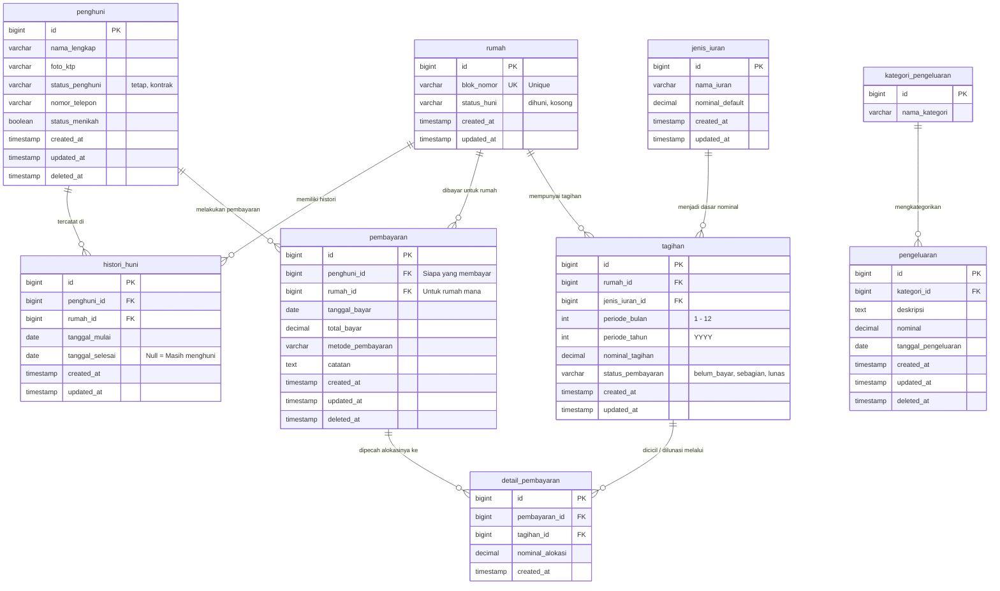
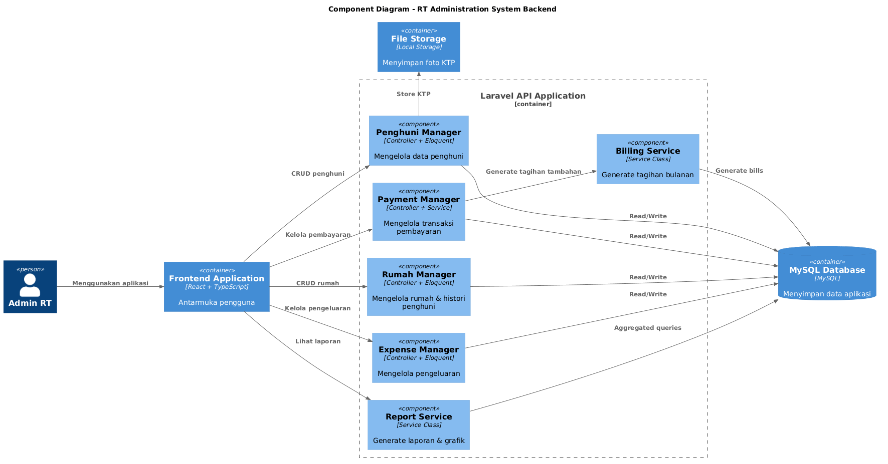

## ERD Diagram


## Project Structure

```
rt-management-app/          <-- Root folder 
│
├── README.md               <-- Panduan instalasi, screenshot fitur, dan ERD
│
├── backend/
│   ├── app/
│   │   ├── Http/
│   │   │   ├── Controllers/    <-- Tempat menerima request, memanggil Service/Model, dan membalikkan response JSON
│   │   │   ├── Requests/       <-- Tempat class validasi input dari user
│   │   │   └── Resources/      <-- Tempat standarisasi format response JSON (menyaring data sensitif, memformat tanggal, dll) sebelum dikirim ke frontend
│   │   │
│   │   ├── Models/             <-- Representasi tabel database dan tempat mendefinisikan relasi antar tabel (Eloquent ORM)
│   │   │
│   │   └── Services/           <-- Tempat menaruh business logic kompleks seperti kalkulasi tagihan bulanan atau query grafik laporan keuangan
│   │
│   ├── database/
│   │   ├── migrations/         <-- Skema pembuatan tabel database
│   │   └── seeders/            <-- Script untuk memasukkan data awal/dummy
│   │
│   ├── routes/                 <-- Tempat mendefinisikan URL/Endpoint
│   │
│   └── storage/
│       └── app/public/         <-- Folder untuk menyimpan file fisik hasil upload dari frontend
└── frontend/               <-- Folder project React
    ├── package.json
    ├── public/
    ├── src/
    │   ├── assets/
    │   ├── components/     <-- Reusable components (Button, Modal, Sidebar)
    │   ├── pages/          <-- Halaman utama (Dashboard, Penghuni, Rumah, Keuangan)
    │   ├── services/       <-- Konfigurasi Axios untuk memanggil API backend
    │   ├── utils/          <-- Helper (format uang Rupiah, format tanggal)
    │   ├── App.tsx
    │   └── main.tsx
    └── .env.example        <-- Simpan VITE_API_URL=http://localhost:8000/api
```
## Component Diagram


